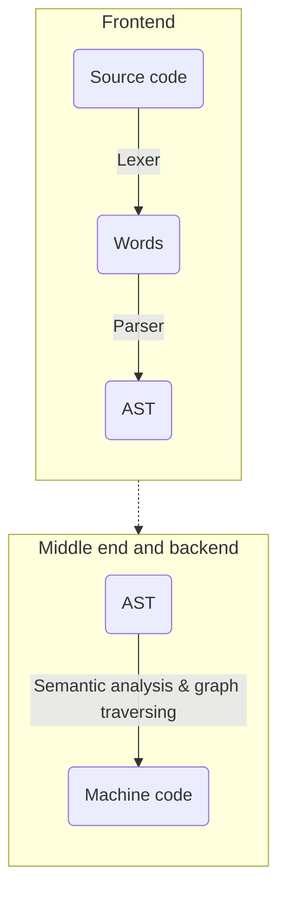

## About
This is a personal hobby-made language written in C++ together with Flex/Bison tools. The goal is to simulate the translation of the programming language into assembly code through the syntax tree and to execute it.



## Some info

### Supported structures, operations and statements
- assignment of values to the variables
- printing and scaning input
- arithmetic, logical and bitwise operations
- loop and if-else statements (individual or nested)
- fixed-size arrays
- defining and calling functions

## Running the compiler

First, type 
```
source build.sh
```
This will create the parser. In order to run your code, you need to type a command that looks like 
```
exp file_name.exp executable_name
```
This will run the parser and compiler and translate your program to assembly file, which will later on be translated to an executable file. At the end, you can run your program by typing ```./executable_name``` .
