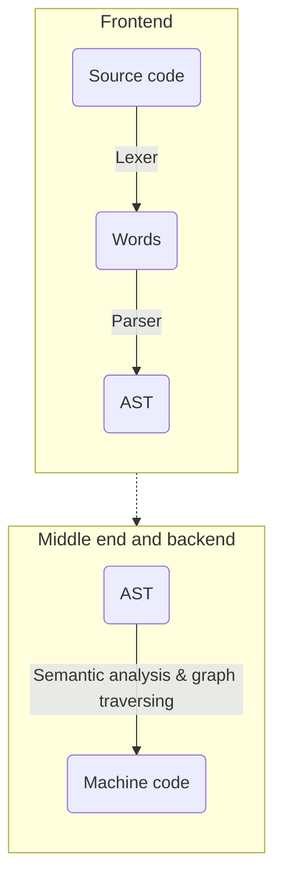

## About
This is a personal hobby-made language written in C++ together with Flex/Bison tools. The goal is to simulate the translation of the programming language into assembly code through the syntax tree and to execute it.



## Some info

### Supported structures, operations and statements
- assignment of values to the variables
- printing and scaning input
- arithmetic, logical and bitwise operations
- loop and if-else statements (individual or nested)
- fixed-size arrays
- defining and calling functions

## Running the compiler
First, run ``` ./install.sh ``` inside the ```Exper``` directory to install necessary executables. Then, type
```
source /bin/exp.sh
```
to make running command visible. Finally, you can type
```
exp_run your_file.exp your_executable 
```
to compile and run your code.
