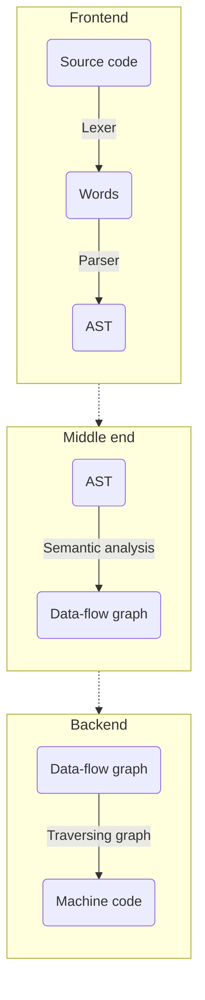

## About
This is a personal hobby-made language written in C++ together with Flex/Bison tools. The goal is to simulate the translation of the programming language into assembly code through the syntax tree and to execute it.


(Note: previous picture shows how it looks like in theory. In this language, AST and data-flow graph are the same tree-like structure, with variables-checker and assembly-printing functions traversing it. Also, there is no IR; everything is being literally translated into assembly).

## Some info

### Project goals
 - [X] Fix some minor bugs regarding the assembly code
 - [X] Fix subtraction and shifting
 - [X] Make comments
 - [X] Make error messages verbose
 - [x] Implement if-else statement
 - [X] Implement loop statement
 - [x] Make static arrays
 - [X] Make scan function
 
### Supported structures, operations and statements
- assignment of values to the variables
- printing and scaning input
- arithmetic, logical and bitwise operations
- loop and if-else statements (individually or nested)
- static arrays (out-of-bounds checking yet to be added)

## Running the compiler

First, type 
```
source build.sh
```
This will create the parser. In order to run your code, you need to type a command that looks like 
```
fkc file_name.fkc executable_name
```
This will run the parser and compiler and translate your program to assembly file, which will later on be translated to an executable file. At the end, you can run your program by typing ```./executable_name``` .
If you want to enable/disable variable-checking function, you can type ```enable``` or ```disable``` with the ```--var-check``` option.

### Example 

```
a := 1;
b := a << 5;
print(b);

ab[] := [5;5]; 
cd[] := {1,2,3};

ab[0] := 1;
ab[1] := 2;
print(ab[0]);

if (b < 10) {
    c := b;
}
else {
    c := 10;
};

d := c;

while (d > 0) {
    print(d);
    d := d - 1;
};
```


